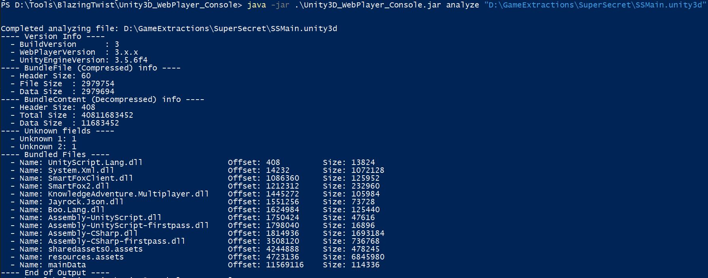
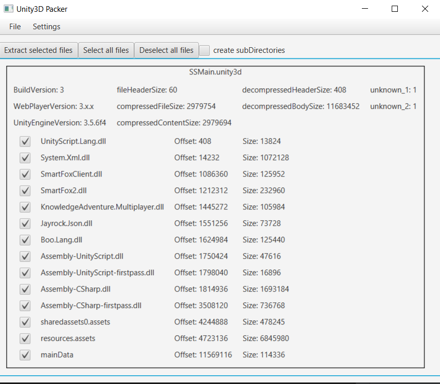

## Console Application

|Command|Description|
|---|---|
|analyze \<bundleFile\>|Output information on the bundle and its files|
|unpack \<bundleFile\>|Unpack the bundled files into a directory of the same name as the bundleFile|
|unpack \<bundleFile\> <targetDirectory>|Unpack the bundled files into the targetDirectory|
|pack \<sourceDirectory\> \<webPlayerVersion\> \<unityEngineVersion\>|pack all files in sourceDirectory to a 'sourceDirectory.unity3d' bundle|
|pack \<sourceDirectory\> \<targetFile\> \<webPlayerVersion\> \<unityEngineVersion\>|pack all files in sourceDirectory, save as targetFile|

 

## Gui Application

